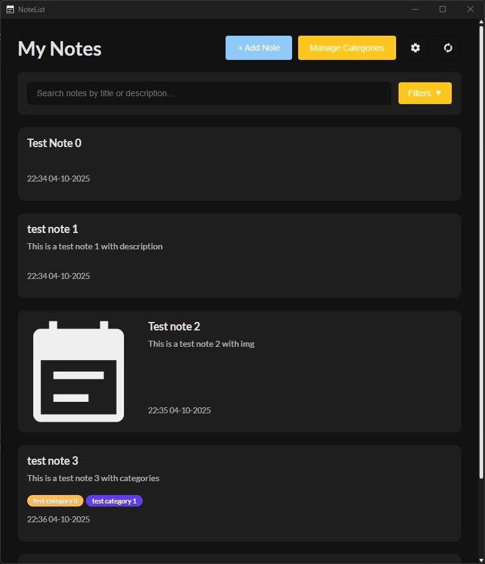
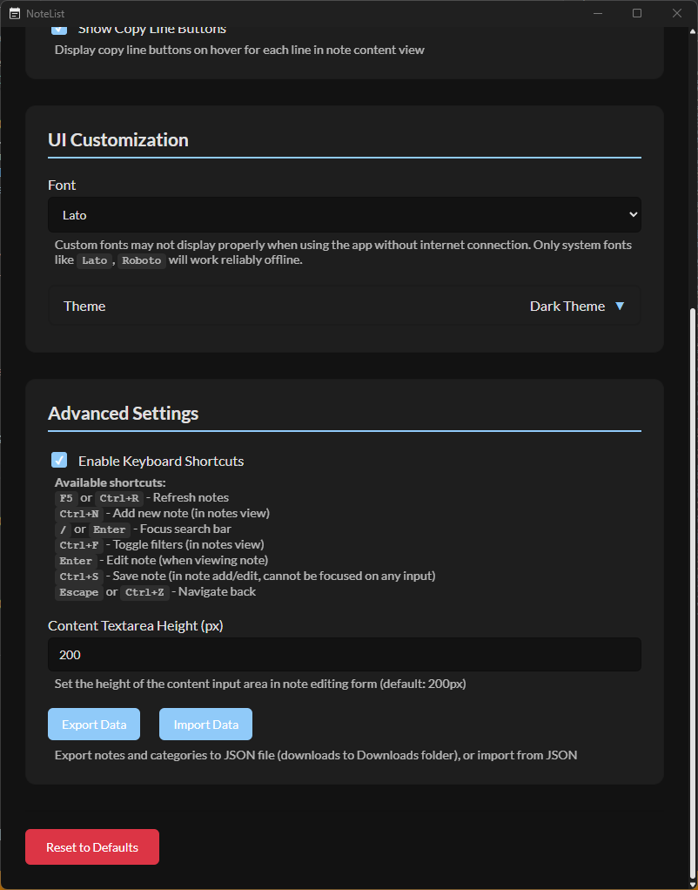

# NoteList - Note Management Application


## Table of Contents

- [About](#about)
- [Technologies](#technologies)
- [Key Features](#key-features)
  - [📝 Note Management](#📝-note-management)
  - [🏷️ Category System](#🏷️-category-system)
  - [🔍 Advanced Filtering](#🔍-advanced-filtering)
  - [⌨️ Keyboard Shortcuts](#⌨️-keyboard-shortcuts)
  - [🎨 Theme System](#🎨-theme-system)
  - [⚙️ Advanced Settings](#⚙️-advanced-settings)
- [Screenshots](#screenshots)
- [Data Structure](#data-structure)
- [Data Storage](#data-storage)
- [Installation and Setup](#installation-and-setup)
- [Technical Features](#technical-features)
- [License](#license)

## About

NoteList is a modern desktop application for managing notes, designed with simplicity and advanced organizational features in mind. The application enables creating, editing, and categorizing notes with the ability to add images and advanced content filtering.

## Technologies

- **Frontend**: Angular 20.1.4
- **Backend**: Tauri (Rust)
- **Data Storage**: JSON files (local storage)

## Key Features

### 📝 Note Management
- Create new notes with title, description, and content
- Add images to notes
- Edit existing notes
- Delete notes
- Move notes up/down (reorder notes)

### 🏷️ Category System
- Create custom categories with custom colors
- Assign categories to notes
- Filter notes by categories
- Manage categories (add, edit, delete)

### 🔍 Advanced Filtering
- Search by note title and description
- Filter by categories (multiple selection)
- Active filters preview

### ⌨️ Keyboard Shortcuts

#### Notes List
- `F5` or `Ctrl+R` - Refresh notes
- `Ctrl + N` - New note
- `Ctrl + F` - Toggle category filters
- `/` or `Enter` - Focus search field

#### Note View
- `Enter` - Edit note
- `Escape` or `Ctrl + Z` - Return to notes list

#### Note Editor
- `Ctrl + S` - Save note
- `Escape` or `Ctrl + Z` - Return to previous view

#### Category Management
- `/` or `Enter` - Focus category search
- `Escape` or `Ctrl + Z` - Return to notes list

#### Settings
- `Escape` or `Ctrl + Z` - Return to notes list

### 🎨 Theme System
- 20 predefined color themes
- Real-time theme preview
- Themes: Dark (default), Light, Nature, Cyberpunk, Matrix, Galaxy and many more
- Font management (25+)

### ⚙️ Advanced Settings
- User interface personalization
- Notification display control
- Creation date display settings
- Active filters configuration

## Screenshots

### Notes List


*Application view with no notes - clean, minimalist list ready for the first note*



*Examples of different note types: simple text, with descriptions, with images and categories*

### Filtering and Search


*Open category filters with selected category and "test" search, showing active filters*

### Creating and Editing Notes


*New note creation interface with fields for title, description, content, image and categories*


*View of an opened note displaying title, description, img, content and categories*


*View of editing an existing note with filled data*

### Category Management


*Category management panel with ability to add, edit and delete categories plus color selection*

### Application Settings


*First part of application settings with personalization options*



*Second part of settings after scrolling - additional configuration options*


*Expanded list of available color themes with real-time preview*

## Data Structure

### Note Format (JSON)
```json
{
  "id": 1,
  "title": "Sample note",
  "description": "Brief note description",
  "content": "Detailed note content with formatting...",
  "img": "img",
  "categories": ["Work", "Important"],
  "created_at": "2025-10-04T14:30:00.000Z"
}
```

### Category Format (JSON)
```json
{
  "name": "Work",
  "color": "#1976d2"
}
```

## Data Storage

The application uses **local JSON files** to store all data:
- Notes with full content and metadata (`notes.json`)
- Categories with names and colors (`categories.json`)
- User settings
- Images are stored as base64 encoded data directly in note objects

## Installation and Setup

1. **Download the application** from the Releases section
2. **Install** - run the app
3. **First launch** - the application will automatically create the data directory and JSON files

## Technical Features

- **Cross-platform** - runs on Windows, macOS and Linux
- **Native performance** thanks to Tauri
- **Secure storage** - all data stored locally in user's home directory:
  - All platforms: `~/.notelist/notes.json` and `~/.notelist/categories.json`
- **Responsive interface** - smooth animations and transitions
- **Keyboard-friendly** - full keyboard shortcuts support
- **Accessibility** - compliance with accessibility standards

## License

This application was created as an personal project.

---

*NoteList – Easily return to your thoughts*